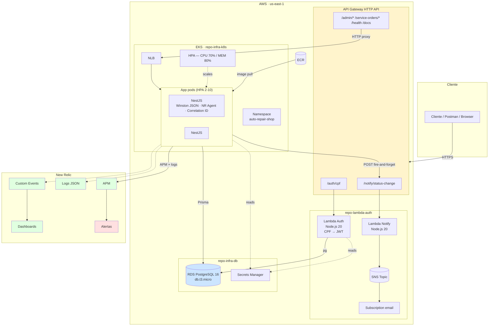

# Diagrama de componentes

Visão completa da arquitetura cloud na AWS.

## Componentes

O **API Gateway HTTP API** é o ponto único de entrada e mora no `repo-lambda-auth` via SAM template. Roteia `/auth/cpf` e `/notify/status-change` pras Lambdas (AWS_PROXY) e as outras rotas pro NLB do EKS (HTTP_PROXY).

A **Lambda Auth** recebe o CPF, valida (algoritmo de dígitos verificadores), consulta a tabela `Customer` no RDS e devolve um JWT com `type: "customer"` válido por 24h. Conexão com Postgres via `pg`, sem ORM — query única, não justifica Prisma.

A **Lambda Notify** recebe payload com status anterior/novo, monta a mensagem em PT-BR e publica num SNS Topic. A subscription do tópico encaminha pra email — em produção viraria fila SQS pra integrar com CRM, mas no escopo é email direto.

O **EKS cluster** roda em 2 AZ com node group `t3.medium` (min 2, max 4). Os pods da app têm HPA configurado pra escalar entre 2 e 10 réplicas. A imagem é puxada do ECR criado dentro do módulo `eks` do Terraform.

A **app NestJS** continua basicamente a Fase 2, com Clean Architecture e Prisma. As adições são `/health` (terminus), Winston JSON com correlation ID, `CombinedAuthGuard` que aceita JWT admin ou customer, e o `NotificationClient` que chama a Lambda Notify de forma assíncrona após cada transição de status. O agent do New Relic carrega antes do bootstrap (`node -r newrelic`).

O **RDS PostgreSQL 16** roda em `db.t3.micro` com 20GB gp3, backup automático de 7 dias. Connection URL fica no Secrets Manager, consumida tanto pela Lambda Auth quanto pelos pods do EKS.

**New Relic** captura APM, logs (via forwarding nativo do Winston), custom events emitidos pelo `CustomMetricsService` e métricas do cluster via `nri-bundle` Helm chart. 4 dashboards e 3 alertas obrigatórios estão versionados em `docs/observability/`.

## Ordem de provisionamento

1. `repo-infra-db` — cria o RDS, exporta `DATABASE_URL` pro Secrets Manager.
2. `repo-lambda-auth` — `sam deploy` cria as 2 Lambdas, o SNS Topic e o API Gateway.
3. `repo-infra-k8s` — `terraform apply` cria VPC, EKS, ECR e os recursos K8s (namespace, configmap, secret, deployment, service, HPA). Também adiciona as rotas HTTP no API Gateway existente.
4. `repo-app` — push em `main` dispara o CI/CD: build, test, push pro ECR e `kubectl apply` no cluster.

## Segurança

Tráfego cliente → API Gateway é HTTPS. API Gateway → Lambda usa integração nativa AWS (mesma conta). API Gateway → NLB do EKS é HTTP integration. Lambda → RDS e pods → RDS rodam dentro da VPC com security group restrito à porta 5432. Os pods chamam a Lambda Notify via HTTPS público pelo API Gateway (fire-and-forget).
