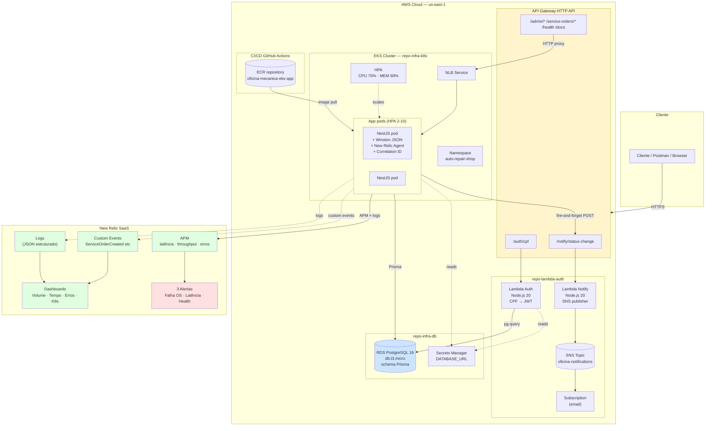

# Diagrama de Componentes — Fase 3

Visão arquitetural completa da solução cloud-native na AWS.



## Componentes principais

| Componente | Tipo | Owner Repo | Detalhe |
|---|---|---|---|
| **API Gateway HTTP API** | Camada de roteamento | `repo-lambda-auth` (via SAM) | Ponto único de entrada; CORS aberto; tracing X-Ray |
| **Lambda Auth** | Function serverless | `repo-lambda-auth` | `POST /auth/cpf` — valida CPF, consulta `Customer` no RDS, emite JWT (24h, `type: "customer"`) |
| **Lambda Notify** | Function serverless | `repo-lambda-auth` | `POST /notify/status-change` — publica mensagem no SNS Topic |
| **SNS Topic** | Pub/sub | `repo-lambda-auth` (SAM) | Subscription de email enviando alerta ao cliente quando OS muda de status |
| **EKS Cluster** | Orquestrador K8s | `repo-infra-k8s` | 2 AZ, node group `t3.medium` min 2 / max 4, VPC privada |
| **App NestJS** | Aplicação | `repo-app` | Domain · Use cases · Controllers · Health · Logging JSON · Combined Auth Guard · Notification Client |
| **HPA** | Autoscaler | `repo-infra-k8s` | min 2 / max 10 pods · CPU 70% · MEM 80% |
| **RDS PostgreSQL** | Banco gerenciado | `repo-infra-db` | `db.t3.micro` · 20GB gp3 · backups 7 dias · Multi-AZ off |
| **Secrets Manager** | Secrets | `repo-infra-db` (SAM gerencia consumption) | Guarda DATABASE_URL serializado |
| **ECR** | Container registry | `repo-infra-k8s` (criado dentro do módulo eks) | Image lifecycle: 10 últimas tags |
| **New Relic** | Observability SaaS | (externo) | APM · Logs · Events · 4 Dashboards · 3 Alertas · K8s integration |

## Fluxo de dependências

```
repo-infra-db   (cria RDS, exporta DATABASE_URL)
        │
        ├─── repo-lambda-auth   (Lambdas usam DATABASE_URL)
        │
        └─── repo-infra-k8s     (App usa DATABASE_URL via ConfigMap/Secret)
                │
                └─── repo-app   (image pull do ECR, deploy via kubectl apply)
```

## Fronteiras de segurança

- API Gateway → Lambda: integração nativa AWS (mesma conta)
- API Gateway → EKS NLB: HTTP integration via NLB DNS
- Lambda → RDS: VPC Configuration (subnets privadas) + Security Group restrito
- Pods → RDS: Security Group permite tráfego só do CIDR da VPC
- Pods → Lambda Notify: HTTPS público (mesmo API Gateway) — fire-and-forget
- Cliente → API Gateway: HTTPS público, sem autenticação na borda (cada handler valida o JWT)
