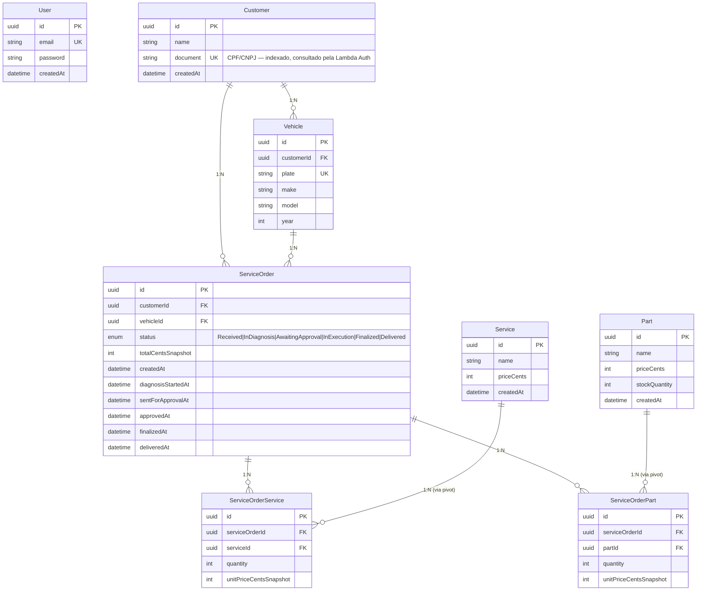

# Diagrama ER + Justificativa

Schema mantido da Fase 2 (Prisma → PostgreSQL no RDS). Formalização do modelo relacional + justificativa de cada relacionamento.

## Diagrama



## Justificativa dos relacionamentos

### 1. `Customer 1:N Vehicle`
- **Decisão:** um cliente pode possuir múltiplos veículos.
- **Por quê:** modelo natural do domínio de oficina mecânica — cliente traz o Gol da esposa hoje, a Hilux do filho amanhã.
- **Implicação:** `Vehicle.plate` é único globalmente (não composto com customerId) porque placa é um identificador nacional único, e a regra de negócio precisa detectar quando um veículo muda de dono.

### 2. `Customer 1:N ServiceOrder` e `Vehicle 1:N ServiceOrder`
- **Decisão:** cada OS pertence a um cliente E a um veículo específico.
- **Por quê:** rastreabilidade completa por ambos os ângulos — listar todas OS de um cliente, ou histórico completo de manutenção de um veículo.
- **Implicação:** integridade referencial garante que toda OS tem um cliente e veículo válidos. Não criamos uma chave composta porque a OS é entidade própria com identidade.

### 3. `ServiceOrder N:M Service` e `ServiceOrder N:M Part` (via pivots)
- **Decisão:** tabelas pivot (`ServiceOrderService`, `ServiceOrderPart`) com colunas extras.
- **Por quê duas tabelas e não uma**: serviço e peça têm semânticas diferentes — peças têm controle de estoque, serviços não.
- **Por que as colunas `quantity` e `unitPriceCentsSnapshot`:** uma OS aprovada precisa congelar o preço naquele momento. Se a oficina aumentar o valor do serviço amanhã, uma OS de ontem mantém o valor pactuado. **Sem snapshot, perdemos auditabilidade e podemos cobrar valor diferente do orçado.**
- **Implicação:** quando o admin atualiza o preço de `Service`, OS antigas não são afetadas.

### 4. `User` (isolado, sem FK para Customer)
- **Decisão:** tabela de admin é totalmente desacoplada de Customer.
- **Por quê:** admin (usuário interno da oficina) e customer (cliente final do veículo) são dois domínios diferentes. Misturá-los em uma tabela `User` polimórfica criaria nulos e regras condicionais por todo lugar.
- **Implicação:** dois fluxos de autenticação independentes — Fase 2 (email/senha → admin JWT) e Fase 3 (CPF via Lambda → customer JWT). O guard `CombinedAuthGuard` diferencia pelo campo `type` do JWT.

### 5. `status` como enum (não tabela)
- **Decisão:** os 6 estados (`Received`, `InDiagnosis`, `AwaitingApproval`, `InExecution`, `Finalized`, `Delivered`) são enum em código + check constraint no banco.
- **Por quê não uma tabela `Status`:** os estados são **fixos** (definidos pelo negócio, não configuráveis pelo admin) e seguem máquina de estados validada no domain layer. Tabela traria overhead de joins sem ganho.
- **Implicação:** mudança em estados exige nova migration + deploy. Aceitável dado que o workflow é estável.

### 6. Timestamps separados por transição
- **Decisão:** `diagnosisStartedAt`, `sentForApprovalAt`, `approvedAt`, `finalizedAt`, `deliveredAt` — colunas dedicadas.
- **Por quê não uma tabela `StatusTransition` (audit log):** o dashboard "Tempo Médio por Status" precisa de cálculo direto (timestamp B - timestamp A). Tabela audit traria 5x mais rows e exigiria janela de tempo.
- **Implicação:** se o domínio crescer (novos estados, rollback), considerar migrar para tabela audit. Por enquanto, colunas dedicadas são pragmáticas.

### 7. `priceCents`, `totalCentsSnapshot` em centavos (inteiros)
- **Decisão:** todos os valores monetários são `Int` em centavos, não `Decimal` em reais.
- **Por quê:** evita problemas de precisão de ponto flutuante (R$ 0.1 + R$ 0.2 ≠ R$ 0.3 em float). Integer sums são exatos.
- **Implicação:** front-end recebe `15000` e formata como "R$ 150,00".

## Indices recomendados

Definidos via Prisma `@@index`:

```prisma
@@index([document])           // Customer — Lambda Auth lookup
@@index([plate])              // Vehicle — busca por placa
@@index([customerId, status]) // ServiceOrder — listagem ativa por cliente
@@index([status, createdAt])  // ServiceOrder — listar ativas ordenadas
```

## Connection settings

- **Pool size:** Prisma default (10) — suficiente para 2-10 pods no HPA
- **SSL:** ativado (RDS encrypted), com `ssl: { rejectUnauthorized: false }` na conexão da Lambda
- **Timeout:** 5s na Lambda (cold start friendly); padrão Prisma no app
