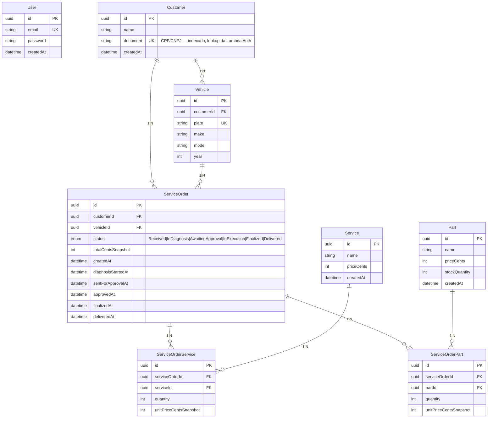

# Diagrama ER

Schema mantido da Fase 2 (Prisma + PostgreSQL), agora rodando no RDS. As entidades e relacionamentos não mudaram estruturalmente — o que mudou foi o lugar do banco e a justificativa formal abaixo.



## Justificativa dos relacionamentos

**Customer 1:N Vehicle** — um cliente pode ter vários veículos. Modelo natural do domínio (cliente leva o Gol da esposa hoje, a Hilux do filho amanhã). `Vehicle.plate` é único globalmente, não composto com `customerId`, porque placa é identificador nacional único e o sistema precisa detectar mudança de dono.

**Customer 1:N ServiceOrder e Vehicle 1:N ServiceOrder** — cada OS pertence a um cliente e a um veículo. Rastreabilidade pelos dois ângulos: listar todas as OS de um cliente, ou histórico completo de um veículo. Não usei chave composta porque a OS é entidade própria com identidade.

**ServiceOrder N:M Service e ServiceOrder N:M Part (via pivots)** — duas tabelas pivot separadas, não uma só, porque serviço e peça têm semânticas diferentes (peça tem controle de estoque, serviço não). As colunas `quantity` e `unitPriceCentsSnapshot` na pivot existem pra congelar o preço da OS no momento da criação. Se a oficina aumentar o valor do serviço amanhã, uma OS de ontem mantém o valor pactuado — sem snapshot, perdemos auditabilidade.

**User isolado** — a tabela do admin não tem FK pra `Customer`. São dois domínios diferentes (usuário interno vs cliente final). Misturar em tabela polimórfica criaria nulos e ifs por todo lado. O guard combinado lê o `type` do JWT pra diferenciar.

**Status como enum** — os 6 estados são fixos, definidos pelo negócio, não configuráveis pelo admin. Tabela `Status` traria joins sem ganho. Mudar estados exige migration nova, o que é aceitável dado que o workflow é estável.

**Timestamps por transição** — `diagnosisStartedAt`, `finalizedAt` etc. são colunas dedicadas em vez de uma tabela `StatusTransition` (audit log). O dashboard "Tempo Médio por Status" calcula direto (`timestamp B - timestamp A`); audit traria 5× mais rows e exigiria janela. Se o domínio crescer (novos estados, rollbacks), migra pra audit.

**Valores em centavos (int)** — todos os monetários são `Int` em centavos, não `Decimal` em reais. Evita problemas de precisão de float (`0.1 + 0.2 ≠ 0.3` em float). Sums de inteiros são exatos. O front formata: recebe `15000`, exibe `R$ 150,00`.

## Indices

```prisma
@@index([document])           // Customer — lookup da Lambda Auth
@@index([plate])              // Vehicle — busca por placa
@@index([customerId, status]) // ServiceOrder — listagem ativa por cliente
@@index([status, createdAt])  // ServiceOrder — listar ativas ordenadas
```

## Conexão

Pool size: default do Prisma (10), suficiente pros 2-10 pods do HPA. SSL ativado (RDS encrypted at rest e in transit). Lambda conecta direto com `pg` e `ssl: { rejectUnauthorized: false }` — pula validação de CA porque o certificado AWS RDS não vem no bundle padrão do Node.
