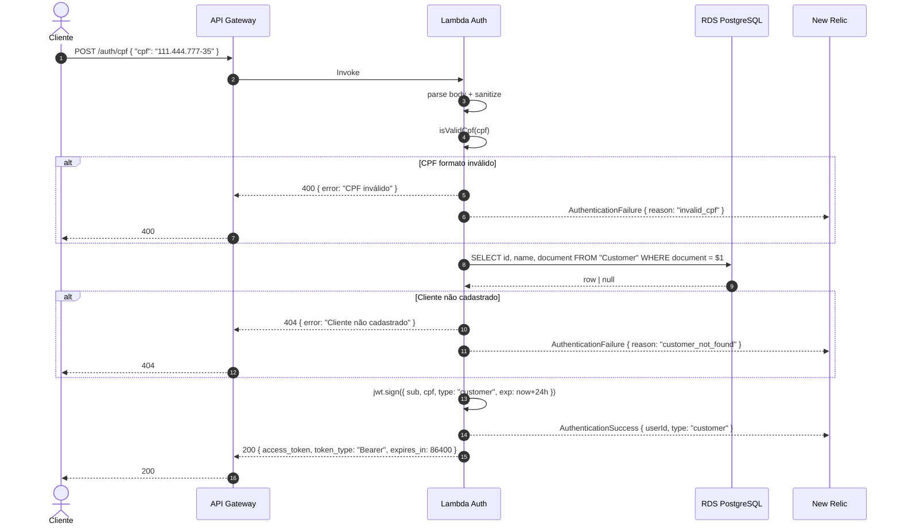

# Sequência — Autenticação por CPF

Fluxo do `POST /auth/cpf`, incluindo erros.

A Lambda mantém o cliente PostgreSQL em cache (`cachedClient`) entre invocações no mesmo execution context. Isso reduz o cold start nas chamadas subsequentes — primeira invocação leva 1-3s, segundas em diante ficam abaixo de 100ms.

O CPF é sanitizado antes de tudo (`replace(/\D/g, '')`) — aceita `123.456.789-09`, `123 456 789 09` ou `12345678909`. Depois passa pelo algoritmo de dígitos verificadores. Repetições tipo `11111111111` são rejeitadas mesmo que matematicamente passem (caso conhecido).

O JWT é assinado com o mesmo `JWT_SECRET` da app principal pra que o guard combinado consiga validar. Payload mínimo: `sub` (uuid do customer), `cpf` (raw), `type: "customer"`, `iat` e `exp`.

Timeout total da Lambda configurado em 15s no SAM. Free tier da AWS cobre 1M invocações/mês e 400.000 GB-s, o que sobra muito pro escopo.
