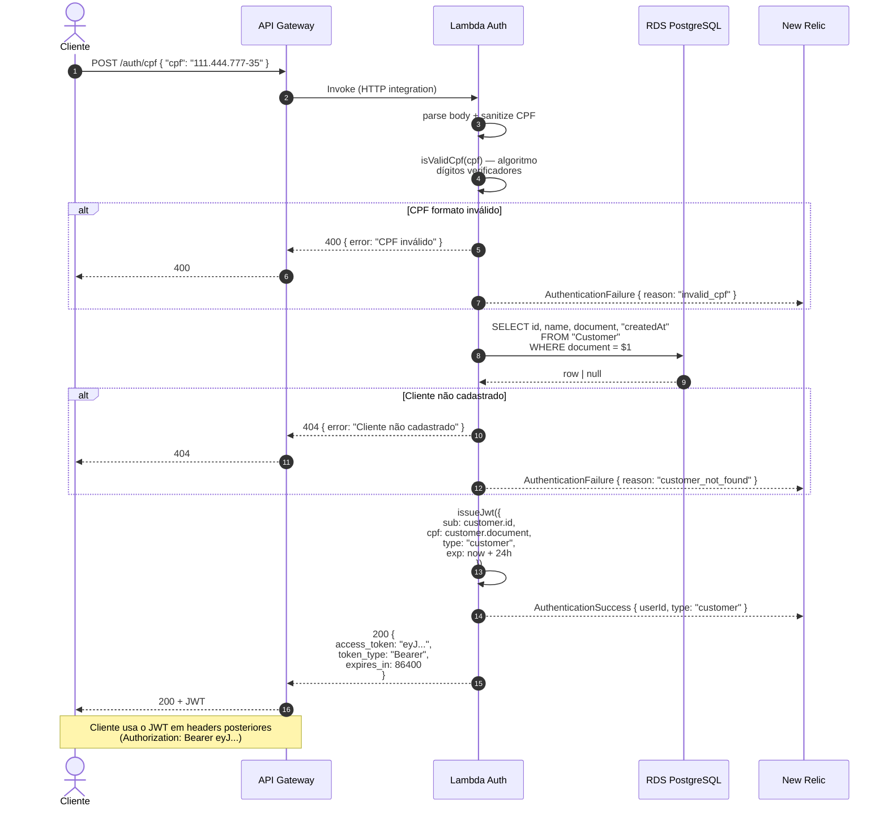

# Diagrama de Sequência — Autenticação por CPF

Fluxo completo do `POST /auth/cpf`. Cobre happy path + cenários de erro.

## Atributos relevantes

| Atributo | Valor |
|---|---|
| Endpoint | `POST {{api-gateway}}/auth/cpf` |
| Auth (na borda) | Nenhuma (validação interna no handler) |
| Connection pooling DB | Lambda cache `cachedClient` (entre invocações da mesma execution context) |
| Timeout total | 15s (SAM Globals.Function.Timeout) |
| Cold start típico | 1-3s (primeira invocação após inatividade) |
| Throughput esperado | Free tier: 1M req/mês |
