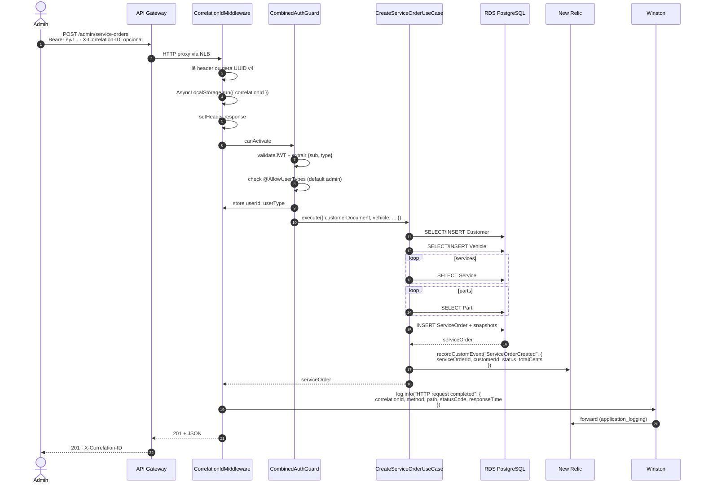
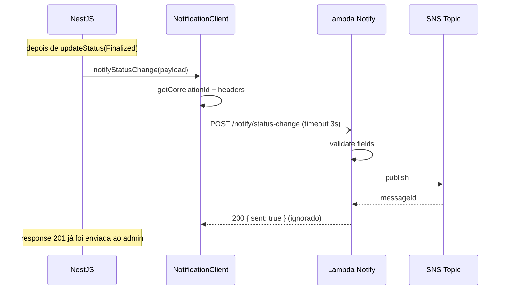

# Sequência — Abertura de ordem de serviço

Fluxo do `POST /admin/service-orders`, com middleware de correlation ID, guard e custom event.

Toda request passa pelo `CorrelationIdMiddleware` primeiro. Se vier `X-Correlation-ID` no header, ele é reutilizado (propagação entre serviços); caso contrário, gera UUID v4. O ID fica no `AsyncLocalStorage` durante todo o ciclo, então Winston e custom events do New Relic capturam automaticamente sem ter que passar nada como parâmetro.

O `CombinedAuthGuard` estende o `AuthGuard('jwt')` do Passport. Depois da validação padrão, lê o `@AllowUserTypes` da rota e decide. Default sem decorator é só admin — preserva o comportamento da Fase 2 sem precisar tocar nos controllers existentes.

Cada transição de status posterior (`/start-diagnosis`, `/finalize` etc.) emite outro custom event `ServiceOrderStatusChanged`. Os use-cases de `finalize` e `deliver` adicionalmente chamam a Lambda Notify:

A chamada à Lambda Notify usa RxJS sem `await` (fire-and-forget). Se a Lambda demorar ou cair, o `catchError` loga warning e o fluxo do admin não trava. Falha vira métrica `ServiceOrderError` no New Relic, que é parte do alerta de falha em OS.
