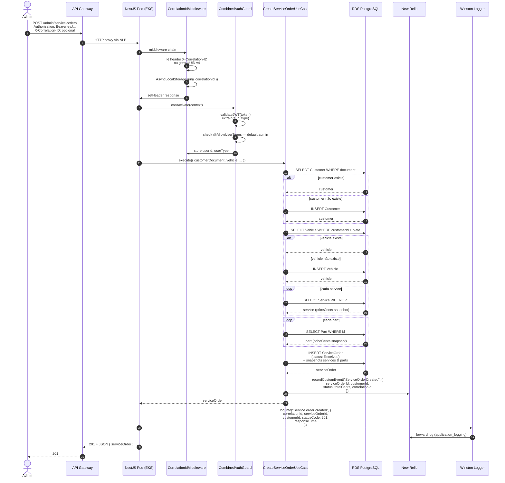
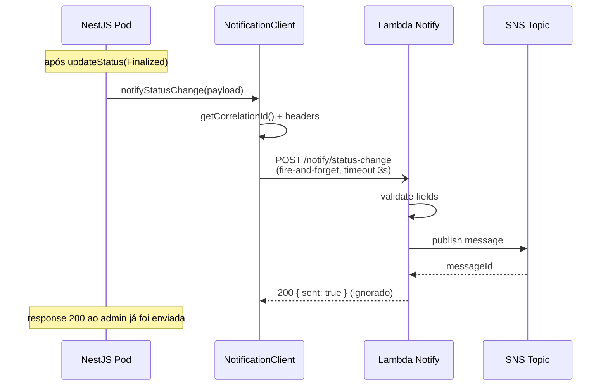

# Diagrama de Sequência — Abertura de Ordem de Serviço

Fluxo completo do `POST /admin/service-orders`. Cobre criação + métricas + log estruturado.

## Atributos da request

| Header / Body | Valor exemplo |
|---|---|
| `Authorization` | `Bearer eyJhbGciOi...` (JWT admin) |
| `X-Correlation-ID` | `7b4a2cf2-9d3b-4a1e-8e51-3c6b9d1f0a22` (opcional na request; sempre retornado na response) |
| Body | `{ "customerDocument": "111.444.777-35", "vehicle": { "plate": "ABC1234", ... }, "serviceIds": [...] }` |

## Side effects no New Relic

- 1 Transaction APM (`POST /admin/service-orders`)
- 1 Custom Event `ServiceOrderCreated`
- 1-N entradas de Log (Winston → application_logging forwarding)
- Distributed Tracing automático cobre DB calls

## Transição de status disparando Notify Lambda

`POST /admin/service-orders/:id/finalize` segue o mesmo padrão, mas adicionalmente:

A chamada para a Lambda é **assíncrona** (RxJS `firstValueFrom` sem await). Se a Lambda estiver down ou demorar, a response ao admin não é bloqueada. Falha é apenas logada.
